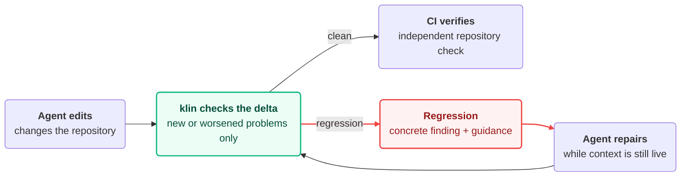

<picture>
  <source media="(prefers-color-scheme: dark)" srcset="assets/klin-logo-dark.svg">
  <source media="(prefers-color-scheme: light)" srcset="assets/klin-logo-light.svg">
  
</picture>

# Catch regressions while the agent can still fix them

**Deterministic quality control for coding agents.**

klin catches new or worsened deterministic problems during coding-agent work and returns concrete feedback while the working context is still available.

**Works natively with:** Claude Code · Codex · Cursor

```text
FAIL  complexity
      FAIL: 1 function(s) got worse — the ratchet only tightens:
        src/quote.ts:18  cc 11, 35 lines, was cc 10, 33 lines
      Reduce the function's responsibility or decision complexity. …
```

## How klin works



## Quick start

### 1. Install

From your repository root on macOS, Ubuntu 22.04+, or Debian 12+:

```sh
sh -c 'i=$(curl --proto "=https" --tlsv1.2 -LsSf https://github.com/brajevicm/klin/releases/latest/download/klin-installer.sh) && sh -c "$i" && ~/.local/bin/klin install'
```

klin detects the supported hosts already used by the repository. If none are found, it configures Claude Code, Codex, and Cursor.

Commit `klin.json` and the generated integration files.

Only want one host? Append `--host claude`, `--host codex`, or `--host cursor` to the final `klin install` command.

> [!NOTE]
> **Codex:** run `/hooks`, review and trust the klin hooks, then start a fresh session.

### 2. Work normally

Use your coding agent as usual.

klin marks the work boundary and checks the delta when the agent tries to finish. New or worsened deterministic problems go back to the agent while the change is still in context.

### 3. See what happened

```sh
klin stats --session
```

```text
Nothing needs your attention.

klin caught 1 regression this session.
It was fixed after klin flagged it.
```

Use `klin stats --all` for individual findings or `klin stats --json` for machine-readable output.

## Native plugins

**Alternative to the repository-hook setup above.**

Claude Code, Codex, and Cursor can also run klin through their native plugin systems.

Plugins do not expose the `klin` CLI. If plugin and repository hooks are both present, one copy handles each event and the other stays quiet.

### Claude Code

```text
/plugin marketplace add brajevicm/klin
/plugin install klin@klin
```

### Codex

```sh
codex plugin marketplace add brajevicm/klin
codex plugin add klin@klin
```

Then run `/hooks`, trust the klin hooks, and start a fresh session.

### Cursor

<details>
<summary><strong>Install the local plugin</strong></summary>

```sh
d=$(mktemp -d) &&
  git clone --depth 1 --branch v0.4.1 https://github.com/brajevicm/klin "$d" &&
  mkdir -p ~/.cursor/plugins/local &&
  rm -rf ~/.cursor/plugins/local/klin &&
  cp -R "$d/plugins/klin" ~/.cursor/plugins/local/klin
s=$?; rm -rf "$d"; [ "$s" -eq 0 ] || {
  echo "klin: the Cursor plugin copy failed. Run it again once the fetch works." >&2
  false
}
```

Reload Cursor.

</details>

Opt the repository in:

```sh
echo '{}' > klin.json
```

`{}` is a complete configuration. klin derives repository facts automatically.

## Why klin

A coding agent can complete the requested task while making something else worse.

Most deterministic tools tell you what is wrong **now**. klin adds the change boundary:

**Did this problem appear or get worse during this work?**

```text
quality debt        before    after    result
unchanged               8        8       ✓ pass
improved                8        6       ✓ pass
worsened                8        9       ✗ fail
```

Existing debt does not block adoption. Only new or worsened debt fails.

**Deterministic, not another LLM.** klin measures specific properties and returns concrete evidence instead of asking another model whether the code is "good."

**No baseline to maintain.** The before-state comes from the repository and the work boundary.

**Repair now, verify later.** Local hooks return findings while the agent still has context. CI independently checks the committed result.

**The agent fixes code, not the bar.** Intentional exceptions are human-reviewed policy in `accepted`.

## What klin catches

- **Complexity creeps up.** A function becomes too complex or too large for the repository's current bar.
- **Architecture drifts.** A new dependency cycle appears, code crosses a configured layer, or a project convention is broken.
- **Guardrails get bypassed.** A test disappears or gets skipped, or the change adds `@ts-ignore`, `eslint-disable`, or another escape hatch.
- **Work is left unfinished.** New TODOs, placeholders, stubs, or unreachable code remain behind.
- **A public contract changes.** An exported surface disappears or its declared contract changes.
- **Dependencies fall out of sync.** A dependency is missing from the lockfile, loses its exact pin, or resolves differently.
- **Documentation goes stale.** Code moves, but documentation still points to the old location.

Keep your linters, type checkers, tests, security scanners, static analysis, AI review, and human review. klin adds a deterministic ratchet around the agent's change.

Tools that emit SARIF can feed findings through the same new-or-worsened model.

[Configuration and language coverage →](docs/REFERENCE.md)

## CI

**Local hooks provide feedback. CI enforces.**

GitHub Actions, after checkout:

```yaml
- uses: brajevicm/klin@v0.4.1
```

Other CI:

```sh
klin gate --strict
```

Make the check required. Require review for changes to `klin.json` and the generated hook files.

[Trust model and enforcement boundaries →](docs/THREAT_MODEL.md)

## Tested on real coding-agent work

klin has been tested across repeated controlled coding-agent runs.

[Read the coding-agent validation →](docs/benchmark-result-2026-09-25.md)

## Learn more

- [Configuration reference](docs/REFERENCE.md)
- [Host compatibility](docs/HOST_COMPATIBILITY.md)
- [Trust and enforcement](docs/THREAT_MODEL.md)
- [Agent instructions](plugins/klin/skills/klin/SKILL.md)
- [Integrating another coding-agent harness](docs/HARNESS_INTEGRATION.md)
- [Coding-agent validation](docs/benchmark-result-2026-09-25.md)

Found a problem or have a question? [Open an issue](https://github.com/brajevicm/klin/issues/new/choose).  
Security issue? [Follow the private reporting instructions](SECURITY.md).

[Apache-2.0](LICENSE)
