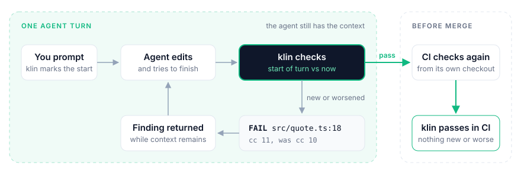

<p align="center">
  <picture>
    <source media="(prefers-color-scheme: dark)" srcset="assets/klin-logo-dark.svg">
    <source media="(prefers-color-scheme: light)" srcset="assets/klin-logo-light.svg">
    
  </picture>
</p>

<h1 align="center">Catch regressions while the agent can still fix them</h1>

<p align="center"><strong>Quality control for coding agents.</strong></p>

<p align="center">
  A coding agent can finish the task you asked for while making something else measurably worse.<br>
  klin returns new or worsened problems while the agent still has the context to respond.
</p>

<p align="center">
  <a href="https://github.com/brajevicm/klin/releases/latest"></a>
  <a href="https://github.com/brajevicm/klin/actions/workflows/quality.yml"></a>
  <a href="LICENSE"></a>
  <a href="docs/HOST_COMPATIBILITY.md"></a>
</p>

```text
FAIL  complexity
      FAIL: 1 function(s) got worse — the ratchet only tightens:
        src/quote.ts:18  cc 11, 35 lines, was cc 10, 33 lines
      Reduce the function's responsibility or decision complexity. …
```

## How klin works

<picture>
  <source media="(prefers-color-scheme: dark)" srcset="assets/klin-how-it-works-dark.svg">
  
</picture>

## Quick start

### 1. Install

From your repository root on macOS, Ubuntu 22.04+, or Debian 12+:

```sh
curl --proto '=https' --tlsv1.2 -LsSf https://github.com/brajevicm/klin/releases/latest/download/klin-installer.sh | sh
source $HOME/.local/bin/env

# Set up this repository. For Claude Code only, add --host claude.
klin install
```

Then commit `klin.json` and the generated integration files.

Prefer installing through your host? See [Native integrations](#native-integrations) below.

klin sets up the hosts your repository already uses. If it finds none, it sets up Claude Code, Codex, and Cursor. To set up only one, append `--host claude`, `--host codex`, or `--host cursor` to `klin install`.

If your shell can't find `klin` afterwards, open a new terminal. To update later, run `klin update`, then `klin install`.

> [!NOTE]
> **Codex:** run `/hooks`, review and trust the klin hooks, then start a fresh session.

### 2. Work normally

Use your coding agent as usual. You don't need to run anything.

When the agent tries to finish a turn, klin compares the code with how it was when the turn started. New or worsened problems go back to the agent while the change is still in its context.

### 3. See what happened

```sh
klin stats --session
```

```text
Nothing needs your attention.

klin caught 1 regression this session. It was fixed after klin flagged it.
```

Add `--all` for individual findings or `--json` for machine-readable output.

## Why klin

Most deterministic tools tell you what is wrong **now**. klin asks:

**Did this problem appear or get worse during this work?**

```text
quality debt        before    after    result
unchanged               8        8       ✓ pass
improved                8        6       ✓ pass
worsened                8        9       ✗ fail
```

Existing debt does not block adoption. Only new or worsened debt fails. The one exception is a broken build: it blocks the agent until the code builds again.

**Deterministic, not another LLM.** klin measures specific properties and shows concrete evidence.

**No baseline to maintain.** klin reads the before-state from Git, so there is no baseline file to keep in sync.

**Repair now, verify later.** Local hooks return findings while the agent still has context. CI checks the committed result on its own.

**The agent fixes code, not the bar.** Intentional exceptions go in `accepted`, and a person reviews them.

## What klin catches

- **Complexity creeps up.** A function grows too complex or too long for the repository's current bar.
- **Architecture drifts.** Code crosses a layer you defined, closes a new dependency cycle, or breaks a convention you wrote down. These checks need a `layering` or `conventions` section in `klin.json`.
- **Guardrails get bypassed.** A test gets skipped, or the change adds `@ts-ignore`, `eslint-disable`, or another escape hatch. If a test disappears, klin asks the agent about it once.
- **Work is left unfinished.** The change adds a TODO, a placeholder, a stub, or code that nothing references.
- **A public contract changes.** An exported Rust or TypeScript surface disappears or changes its declared contract.
- **Dependencies fall out of sync.** A dependency is missing from the lockfile, loses its exact pin, or has a version the lockfile does not record.
- **Documentation goes stale.** A Markdown file at the repository root still points to a path the code moved away from.

Keep your linters, type checkers, tests, security scanners, and reviews. klin adds a ratchet around the agent's change.

A scanner that writes SARIF can report through a `sarif` section in `klin.json`. klin then fails when one of the scanner's results is on a line the change touched.

Language support varies by check. See [full current coverage and configuration →](docs/REFERENCE.md).

## Native integrations

Claude Code, Codex, and Cursor can also install klin through their native plugin systems.

A plugin does not add a `klin` command to your shell. Install the CLI as well if you want `klin stats`. If the plugin and the repository hooks are both present, only one of them handles each event.

### Claude Code

```text
/plugin marketplace add brajevicm/klin
/plugin install klin@klin
```

### Codex

```sh
codex plugin marketplace add brajevicm/klin
codex plugin add klin@klin
```

Run `/hooks`, review and trust the klin hooks, then start a fresh session.

### Cursor

<details>
<summary><strong>Install the local plugin</strong></summary>

```sh
d=$(mktemp -d) &&
  git clone --depth 1 --branch v0.4.2 https://github.com/brajevicm/klin "$d" &&
  mkdir -p ~/.cursor/plugins/local &&
  rm -rf ~/.cursor/plugins/local/klin &&
  cp -R "$d/plugins/klin" ~/.cursor/plugins/local/klin
s=$?; rm -rf "$d"; [ "$s" -eq 0 ] || {
  echo "klin: the Cursor plugin copy failed. Run it again once the fetch works." >&2
  false
}
```

Reload Cursor.

</details>

### Opt the repository in

A plugin does nothing until the repository has a `klin.json`. At the repository root, run:

```sh
echo '{}' > klin.json
```

`{}` is a complete configuration. klin derives everything else from the repository.

## Configure

`{}` runs every automatic check klin can derive from the repository. Use `klin gate --list` to see what applies and which values are derived or pinned.

Policy lives in `klin.json`:

```json
{
  "public_api": false,
  "accepted": [
    {
      "gate": "complexity",
      "file": "src/parser.rs",
      "text": "fn parse(input: &str) -> Ast {",
      "cc": 14,
      "lines": 80,
      "reason": "Legacy parser. Split tracked in #123."
    }
  ]
}
```

Set a check to `false` to turn it off.

To keep a finding on purpose, add it to `accepted` with the values from the FAIL output and a reason. klin holds the finding at those values. If it gets worse, the check fails again.

Only a person changes the policy. klin refuses the agent's edits to `klin.json`.

[Configuration reference →](docs/REFERENCE.md)

## Privacy and trust

- **No telemetry.** klin reads no secrets and sends nothing anywhere.
- **You control the Stop build commands.** The agent Stop hook may run the configured or derived build command before the quality gates. It prints a derived command before it runs it. Set `"build": false` to disable this feedback build.
- **State stays in your repository.** klin keeps its working state under `.git/klin`. By default this includes up to 80 characters of the prompt's first line. Set `"journal": { "prompt": false }` to leave the prompt text out.
- **Downloaded binaries are verified.** The plugin checks the pinned release's SHA-256 before it caches and runs the binary. The installer also verifies what it downloads.

[Threat model →](docs/THREAT_MODEL.md)

## CI

klin works at two levels:

- **Feedback:** hooks only. klin returns findings to the agent and refuses its edits to `klin.json`. Nothing outside the agent's environment checks the result.
- **Enforced:** hooks plus a required CI check on a protected branch. `CODEOWNERS` covers `klin.json`, the workflow, the hook files, and `CODEOWNERS` itself.

The Quick start gets you to Feedback. Add the required klin CI check to get klin's quality policy to Enforced.

The klin CI check does **not** compile, type-check, or test your project, and it does not run the `build` entry from `klin.json`. Keep your project's normal build, type-check, and test steps in CI as separate required checks.

GitHub Actions:

```yaml
- uses: actions/checkout@v5
  with:
    fetch-depth: 0
- uses: brajevicm/klin@v0.4.2
```

Other CI: install klin, fetch the full Git history, then run:

```sh
klin gate --strict
```

## Learn more

- [Host compatibility](docs/HOST_COMPATIBILITY.md)
- [Agent instructions](plugins/klin/skills/klin/SKILL.md)
- [Integrating another coding-agent harness](docs/HARNESS_INTEGRATION.md)
- [Benchmark and validation evidence](docs/benchmark-result-2026-09-25.md)

Found a problem or have a question? [Open an issue](https://github.com/brajevicm/klin/issues/new/choose).  
Security issue? [Follow the private reporting instructions](SECURITY.md).

[Apache-2.0](LICENSE)
